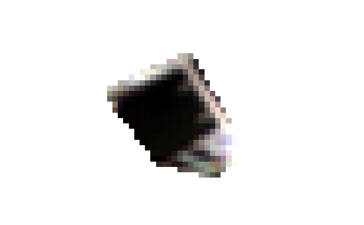
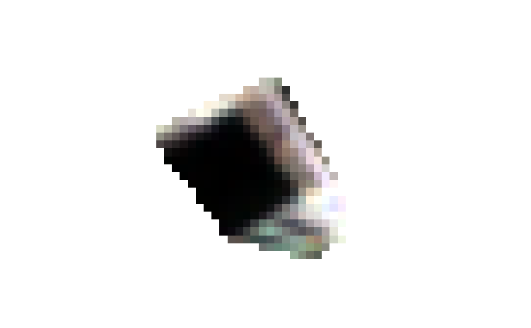

# Sentinel-2 Change Detection Data Pipeline

Python pipeline that produces training data from Sentinel-2 L2A satellite imagery for change detection models.
It automates the download, processing, and tiling of multi-temporal image pairs from a user-defined area of interest (AOI).

## Description

Change detection models learn to identify landscape changes by comparing **before** and **after** satellite images. This pipeline:

1. **Finds the best cloud-free images** for two time periods (T1 and T2) using the STAC API
2. **Downloads and crops** only the AOI at native 10m resolution
3. **Filters clouds and shadows** using the Scene Classification Layer (SCL)
4. **Normalizes spectral bands** to a consistent [0, 1] range
5. **Tiles the output** into fixed-size patches suitable for training
6. **Creates a manifest** linking T1/T2 pairs with their metadata for reproducibility

The pipeline is designed to be containerized and orchestrated (e.g., via Airflow), with all parameters configurable via CLI or environment variables.

## Architecture 


For more information about the architecture: [system_design.md](docs/system_design.md)

## Installation

### Requirements

- Python 3.10+
- GDAL/rasterio system libraries

### Setup

1. **Clone the repository**

```bash
git clone https://github.com/etienne912/sentinel-2-data-processing.git
cd sentinel-2-data-processing
```


2. **Install dependencies**

Using [uv](https://docs.astral.sh/uv/) (recommended):

```shell script
uv sync
```


Or with pip:

```shell script
pip install -e .
```

3. **Run the pipeline**

```shell script
python -m src.main --help
```
```
usage: main.py [-h] --aoi AOI --t1-start YYYY-MM-DD --t1-end YYYY-MM-DD --t2-start YYYY-MM-DD --t2-end YYYY-MM-DD [--tile-size TILE_SIZE]
               [--bands BAND [BAND ...]] [--output-dir OUTPUT_DIR]

Change detection pipeline for Sentinel-2 L2A imagery.

options:
  -h, --help            show this help message and exit
  --aoi AOI             Path to a GeoJSON file defining the area of interest.
  --t1-start YYYY-MM-DD
                        Start date for the T1 (before) search window.
  --t1-end YYYY-MM-DD   End date for the T1 (before) search window.
  --t2-start YYYY-MM-DD
                        Start date for the T2 (after) search window.
  --t2-end YYYY-MM-DD   End date for the T2 (after) search window.
  --tile-size TILE_SIZE
                        Output patch size in pixels. Default: 256.
  --bands BAND [BAND ...]
                        List of Sentinel-2 bands to process (e.g. B02 B03 B04 B08).
  --output-dir OUTPUT_DIR
                        Directory where processed patches and manifest will be saved. Default: ./output.
```

### Output Structure

```
output/
├── manifest.json          # Links T1/T2 tiles + metadata
├── t1/
│   └── S2*_..._{col}_{row}.tif
└── t2/
    └── S2*_..._{col}_{row}.tif
```


Each GeoTIFF contains:
- **CRS**: Projected coordinate system (e.g., UTM)
- **Data type**: float32, values in [0, 1], NaN for masked pixels
- **Band count**: Number of requested bands
- **Tags**: Source product ID, acquisition date, band names

The manifest provides:
- T1 and T2 source product IDs
- Acquisition dates and cloud cover
- Tile file paths and their geospatial bounds

## Example: Bridge Construction in Nantes

On **25 March 2026**, a new bridge (Anne de Bretagne) was installed in Nantes, France. This is a perfect test case because:
- Small AOI (~1 km²) = single Sentinel-2 tile
- Clear before/after imagery available
- Visible change in both optical and infrared bands


You can find more information about the bridge installation in [Ouest-France](https://www.ouest-france.fr/pays-de-la-loire/nantes-44000/cest-fait-le-tablier-du-pont-anne-de-bretagne-est-pose-sur-ses-quatre-piliers-a-nantes-8597ece0-283b-11f1-955e-7a93d197b6cf) (French local newspaper).

### Data
An example GeoJSON AOI and expected outputs are in `docs/exemple/`:

- `nantes_bridge.geojson` — A small polygon around the bridge
- `S2B_30TXT_20260318_0_L2A.png` — Before image (18 March 2026)
- `S2A_30TXT_20260407_1_L2A.png` — After image (7 April 2026)

### Run the Pipeline

```shell script
python -m src.main --aoi docs/example/nantes_bridge.geojson --t1-start 2026-03-01 --t1-end 2026-03-24 --t2-start 2026-04-01 --t2-end 2026-04-17 --bands blue green red --tile-size 16
```


### Understanding the Results

**Before** (18 March 2026) — The construction site is visible, but the bridge deck is not yet in place:



The image shows:
- Urban area
- River and surrounding vegetation
- Construction equipment and staging area

**After** (7 April 2026) — The bridge structure is complete and visible:



The image shows:
- **Bridge deck** clearly visible in the center (linear structure across the river)
- Same urban and vegetation patterns
- Cloud cover is low in both cases, making them ideal training data

### What the Pipeline Outputs

Running the command above produces:

1. **128×128 pixel tiles** (GeoTIFF format, float32) covering the bridge area
2. **Two sets**: one from T1 (before) and one from T2 (after)
3. **Three bands**: Blue, Green, Red
4. **manifest.json**: Metadata linking each T1/T2 pair with source product IDs and acquisition dates

A change detection model can now learn that:
- **Before**: River + vegetation + urban area
- **After**: River + vegetation + urban area + **bridge structure**

The presence/absence of the bridge is the "change" the model learns to detect.

## Using with Airflow

To integrate into an Airflow DAG, import the pipeline function and pass parameters:

```python
from src.main import run_pipeline
import shapely
from airflow.operators.python import PythonOperator

run_task = PythonOperator(
    task_id="process_sentinel2",
    python_callable=run_pipeline,
    op_kwargs={
        "aoi": shapely.from_wkt("POLYGON((...))"),
        "t1_date_range": ("2026-03-01", "2026-03-24"),
        "t2_date_range": ("2026-04-01", "2026-04-17"),
        "bands_keys": ["blue", "green", "red"],
        "tile_size_px": 128,
        "output_dir": "/mnt/data/tiles_output/",
    }
)
```


The function returns a dict with manifest path and tile locations, suitable for downstream XCom.


## Design Notes

- **Assumes small AOIs** (< 1 km²): Typically falls within a single Sentinel-2 MGRS tile
- **No co-registration**: Images are used as-is; assumes Sentinel-2 L2A processing is sufficient
- **Cloud filtering**: Basic threshold on cloud cover percentage; can be extended with per-pixel SCL masking

See [docs/system_design.md](docs/system_design.md) for architectural trade-offs and future work.

## License

The content of this repository is released under the [MIT LICENSE](https://opensource.org/license/MIT). 

Please see the [LICENSE](LICENSE) file for more information.
