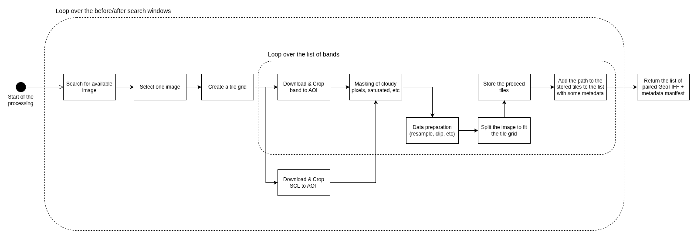

# System Design

## Architecture 

The pipeline is designed around the concept of image pairs, a before (T1) and after (T2), which is the fundamental unit
of input for a change detection model. Also, a change detection model takes as input images of the same size and
spatial resolution, which is going to be a really important requirement for the pipeline.

> **Note:** I'm going to assume that the AOI are small (< 1km). Because Sentinel 2 tiles are slightly overlaping, in
> most of the cases, the AOI should fall in a single tile.

On the diagram, the outer loop iterates over both temporal windows, running the same processing logic for each.

For each window, the pipeline queries the STAC API to find available Sentinel-2 L2A images matching the AOI
and date range, then selects the best candidate based on cloud cover (basic filtering but suffisant for the task).

Before processing the different bands, the pipeline must create a tile grid using the AOI, the tile size specified by
the user, and the CRS of the selected image. It will allow the pipeline to produce same-size images that would cover the whole AOI.
If the grid doesn't perfectly fit the AOI size, it is possible to add some padding as well as overlap.
The tile grid is created taking as resolution 10m.

The SCL (Scene Classification Layer) is downloaded in parallel with the spectral bands and will be used to mask out clouds,
cloud shadows, and saturated pixels before storing the processed image.
To optimize the processing, we use network cropping to avoid downloading the entire image, just the 
area of interest. This is possible because STAC API provides COG (Cloud Optimized GeoTIFF) URLs for each image.

The band values are re-sampled to match the requirements of the training data to fit a 10m resolution, then they are clipped
to the 2nd–98th percentile and scaled to [0, 1].

Before storing each processed band, the image is split following the grid.
Then, the tiles are stored alongside the band metadata, source tile ID, acquisition date, to form the provenance record for that image.

The output of the pipeline is a set of processed, AOI-cropped, cloud-filtered GeoTIFF files for T1 and T2, 
for the requested bands, along with a manifest file that links each pair and its metadata.

## Production readiness

To run this pipeline in production, it would be required to containerize it with Docker to ensure reproducibility across
 environments and expose it as a CLI job that can be triggered manually or scheduled through an orchestrator like Airflow.

Regarding scaling, for large AOIs or batch runs over many time periods, the processing could be distributed across workers
using Celery or Dask, or offloaded to cloud functions.

**What I skipped for time:**

I did not implement data augmentation, or unit tests for each processing step.
I also didn't add data versioning, which in production would be essential for reproducing a specific training dataset.

Also, I did not design and implement a way to deal with AOI that would be overlapped by multiple MGRS/Sentiel-2 tiles.
That would be a significant need for the production-readiness of the pipelines.
Taking into account for AOI that overlaps multiple tiles would mean that we have to download multiple tiles, with different CRS.
Also, the cloud cover metrics to select the image would have to be computed for each tile cropped to the AOI.

Finally, I did not design or implement image co-registration, which might improve the model accuracy.
However, for a model using only Sentinel-2, co-registration may not be necessary.

## Annotation workflow:

For labeling, that goal would be to label patches of land cover change between two timestamps the more accurately possible
and the more efficiently possible.

Efficiently would mean that we need to select in advance samples with a high probability of change, to avoid annotators seeing mostly "no change".
Regarding the task, it would be a good idea to produce RGB images using the Sentinel-2 RGB bands produced by the pipeline,
or any other index that would be relevant to the task.

Regarding the delivery, we need to make sure that the annotators can see the images and labels side by side.
We have to provide the pairs of images and labels in a way that makes it easy for them to do so.

For quality control, we need to make sure that the annotators are not over-annotating or under-annotating.
With five annotators, we could use inter-annotator agreement on a shared subset (e.g., 10% of patches labeled by all 5).
Also, we can have a "low confidence" label option so annotators can flag ambiguous patches rather than wrongfully guess.

Finally, each labeling task should include the patch ID and metadata so labels connect back to the training set unambiguously.

